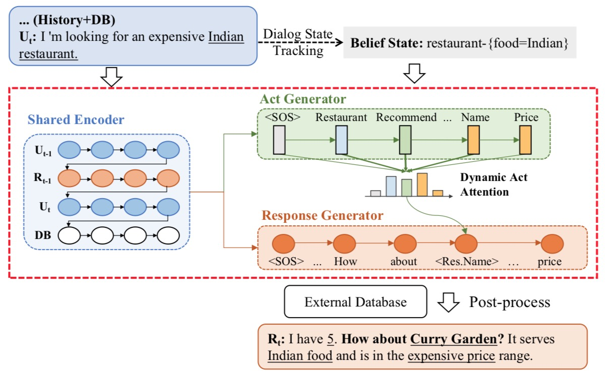

# MarCo

This is the PyTorch implementation of the paper: [Multi-Domain Dialogue Acts and Response Co-Generation](https://arxiv.org/pdf/2004.12363.pdf). We also release the [human evaluation](https://github.com/InitialBug/MarCo-Dialog/tree/master/human_evaluation) results for future research.


## Model Architecture
The model consists of three components, namely, a **shared encoder**, an **act generator** and a **response generator**.
<p align="center">

</p>

### Shared Encoder
Our dialogue act generator and response generator share same encoder and input, while having different masking strategies.

### Act Generator
We model the act prediction as a sequence generation problem and jointly trained with the response generator.

### Response Generator
This module is used to control the response generation based on the output of the act generator.


## Usage
The dataset is already preprocessed and put in [data/](https://github.com/InitialBug/MarCo-Dialog/tree/master/data) folder (train.json, val.json and test.json). We have also uploaded the model checkpoints in [model/](https://github.com/InitialBug/MarCo-Dialog/tree/master/model) folder for those only want to test the performance.  

### Training
```bash
CUDA_VISIBLE_DEVICES=0 python train_generator.py --option train --model model/ --batch_size 384 --max_seq_length 50 --act_source bert
```

### Delexicalized Testing (The entities are normalzied into placeholder like [restaurant_name])
```bash
CUDA_VISIBLE_DEVICES=0 python train_generator.py --option test --model model/MarCo_BERT --batch_size 384 --max_seq_length 50 --act_source bert
```

### Requirements
- torch==1.0.1
- pytorch_pretrained_bert


### Acknowledgements
We sincerely thank the [MultiWoZ team](https://github.com/budzianowski/multiwoz) for publishing such a great dataset.
The code of this work is modified from [HDSA-Dialog](https://github.com/wenhuchen/HDSA-Dialog). We also thank the authors for developing it!
